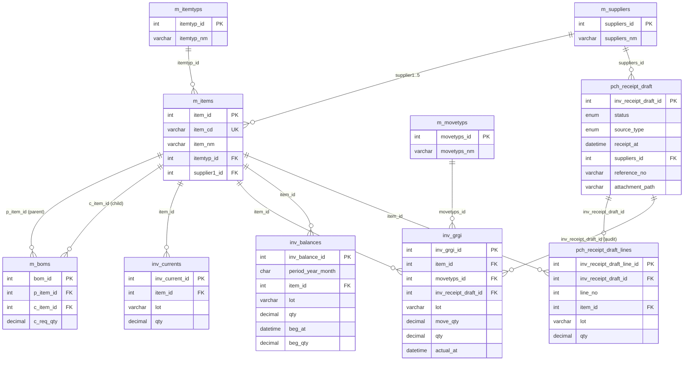

# hanalite ER 図

MySQL データベース `hanalite` の主要テーブル関係（2026-05 時点）。

## 命名規則

| プレフィックス | 意味 | 例 |
|--------------|------|-----|
| `m_` | マスタ | `m_items`, `m_suppliers` |
| `pch_` | 購買（Purchase）トランザクション | `pch_receipt_draft` |
| `inv_` | 在庫（Inventory）トランザクション | `inv_grgi`, `inv_currents` |

## ER 図（Mermaid）



## データフロー（入荷）

```
pch_receipt_draft (registered)
        │
        │ approve
        ▼
inv_grgi (GR) ──► inv_currents
        │
        └── inv_receipt_draft_id でドラフトと紐付け
```

承認前のドラフトは在庫テーブルに触れません。詳細は [ARCHITECTURE.md](./ARCHITECTURE.md) を参照。

## 対応 API

| テーブル | REST API |
|----------|----------|
| `pch_receipt_draft` / `pch_receipt_draft_lines` | `/api/v1/pch-receipt-drafts` |
| `m_items`, `m_itemtyps`, `m_suppliers`, `m_movetyps` | `/api/v1/masters/*` |
| `m_boms` | `/api/v1/boms` |
| `inv_currents`, `inv_grgi`, `inv_balances` | `/api/v1/inventory/*` |
